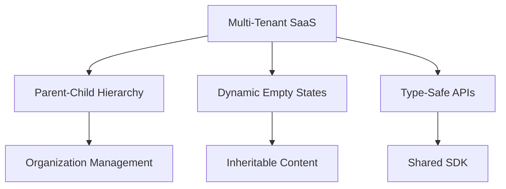
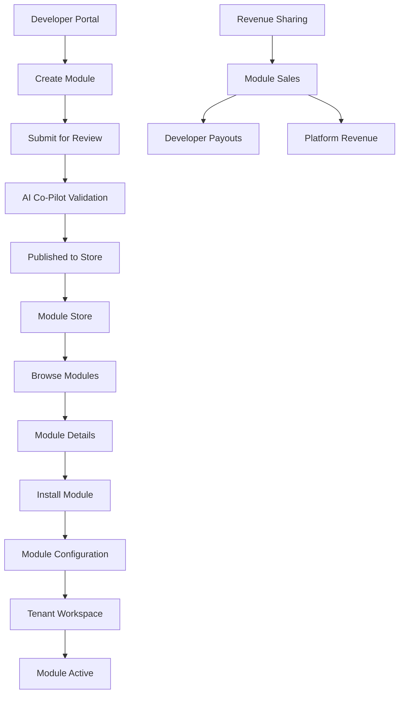

# AI-BOS Engine - SaaS Operating System

AIBOS Engine is a **true SaaS operating system** that provides a modular, plug-and-play platform for business applications. Think of it as "Windows Store for SaaS" - a central platform where organizations can discover, install, and manage business modules while developers can create and monetize their solutions.

## 🚀 Quick Start

```bash
# Install dependencies
pnpm install

# Start development environment
pnpm run dev

# Build all packages
pnpm run build

# Type check
pnpm run type-check

# Test
pnpm run test
```

## 🏗️ Current Architecture

### What We've Built (Production-Ready)

**Multi-Tenant SaaS Foundation:**
- **Supabase Integration** - PostgreSQL + Auth + Real-time
- **Parent-Child Tenants** - Hierarchical organization structure
- **Dynamic Empty States** - Inheritable, multi-tenant onboarding
- **Type-Safe Development** - Full TypeScript with shared types
- **Bulletproof Backend** - Circular reference prevention, inheritance rules

**Core Components:**
1. **Admin Console** (`apps/admin-app/`) - Tenant management interface
2. **Core Engine** (`apps/core-engine/`) - Backend API services
3. **Module Store** (`apps/module-store/`) - Marketplace interface
4. **Tenant Portal** (`apps/tenant-portal/`) - Customizable tenant interface

### Shared Packages

| Package | Responsibility | Status |
|---------|---------------|---------|
| `@aibos/core-sdk` | Core SDK with tenant hierarchy | ✅ Complete |
| `@aibos/types` | Shared TypeScript types | ✅ Complete |
| `@aibos/auth` | Multi-tenant authentication | ✅ Complete |
| `@aibos/database` | Database schema & migrations | ✅ Complete |
| `@aibos/billing` | Subscription management | 🔄 In Progress |
| `@aibos/observability` | Monitoring & metrics | 🔄 In Progress |
| `@aibos/module-validator` | Module validation | 🎯 Planned |
| `@aibos/module-deployer` | Module deployment | 🎯 Planned |

## 🎯 Key Features

### Current Implementation


### Marketplace Flow


### Tenant Management
- **Hierarchical Structure** - Parent organizations with child tenants
- **Data Isolation** - Row-level security with Supabase RLS
- **Inheritance Rules** - Empty states and settings cascade down
- **Group Mode** - Toggle between shared and isolated data

### Module System (Foundation)
- **Registry System** - Track installed modules and versions
- **Dependency Management** - Automatic resolution and validation
- **Safe Installation** - Rollback capabilities and validation
- **Metadata Validation** - Ensure module compatibility

## 🛠️ Development Setup

### Prerequisites
- **Node.js** 20.x+ (LTS)
- **pnpm** 8.x+
- **Supabase** account and project

### Environment Setup
```bash
# Clone the repository
git clone <your-repo>
cd aibos_engine

# Install dependencies
pnpm install

# Set up environment variables
cp env.example .env.local
# Edit .env.local with your Supabase credentials

# Start development
pnpm run dev
```

### Environment Variables

| Variable | Description | Required | Example |
|----------|-------------|----------|---------|
| `SUPABASE_URL` | Your Supabase project URL | ✅ | `https://your-project.supabase.co` |
| `SUPABASE_ANON_KEY` | Supabase public key | ✅ | `eyJhbGciOiJIUzI1NiIsInR5cCI6IkpXVCJ9...` |
| `SUPABASE_SERVICE_ROLE_KEY` | Supabase service role key | ✅ | `eyJhbGciOiJIUzI1NiIsInR5cCI6IkpXVCJ9...` |
| `NEXT_PUBLIC_APP_URL` | Your app's public URL | ✅ | `http://localhost:3000` |
| `STRIPE_SECRET_KEY` | Stripe secret key for payments | 🔄 | `sk_test_...` |
| `STRIPE_PUBLISHABLE_KEY` | Stripe publishable key | 🔄 | `pk_test_...` |
| `DATABASE_URL` | Direct database connection | 🔄 | `postgresql://...` |
| `JWT_SECRET` | JWT signing secret | 🔄 | `your-secret-key` |

### Database Setup
```sql
-- Run in Supabase SQL Editor
-- This creates the multi-tenant schema
BEGIN;
CREATE TYPE tenant_type AS ENUM ('individual', 'organization');
-- ... (see scripts/add-descendants-function.sql for full schema)
COMMIT;
```

## 🚀 What We're Building Toward

### Vision: SaaS Marketplace Ecosystem

**For Organizations:**
- **One-Click Installation** - Install business modules like apps
- **Customizable Workspace** - Mix and match functionality
- **Scalable Growth** - Add modules as your business grows

**For Developers:**
- **Module Marketplace** - Publish and monetize your solutions
- **Revenue Sharing** - Earn from module installations
- **Quality Standards** - AI Co-Pilot ensures code quality

**For the Platform:**
- **Network Effects** - More modules attract more users
- **Quality Control** - Automated validation and testing
- **Scalable Infrastructure** - Handle thousands of tenants

## 📦 Module Ecosystem

### Module Types
- **CRM Modules** - Customer relationship management
- **ERP Modules** - Enterprise resource planning
- **HR Modules** - Human resources management
- **Accounting Modules** - Financial management
- **Custom Modules** - Any business functionality

### Module Development
```typescript
// Example module structure
interface ModuleMetadata {
  id: string;
  name: string;
  version: string;
  category: ModuleCategory;
  dependencies: string[];
  permissions: ModulePermissions;
  entryPoints: ModuleEntryPoints;
}
```

## 🔒 Security & Compliance

### Multi-Tenant Security
- **Row-Level Security** - Data isolation between tenants
- **Role-Based Access** - Fine-grained permissions
- **Audit Logging** - Complete activity tracking
- **Circular Reference Prevention** - Safe tenant hierarchies

### Data Protection
- **Encryption** - At rest and in transit
- **Backup Strategy** - Automated with failover
- **Compliance Ready** - GDPR, CCPA support
- **Privacy Controls** - User data management

### Security Headers & Protections
- **Content Security Policy** - Prevent XSS attacks
- **CSRF Protection** - Cross-site request forgery prevention
- **HTTP Security Headers** - HSTS, X-Frame-Options, X-Content-Type-Options
- **Secret Rotation** - Automated key management
- **Vulnerability Scanning** - Regular security audits
- **Module Sandboxing** - Isolated execution environment

### Authentication & Authorization
- **Multi-Factor Authentication** - Enhanced login security
- **Session Management** - Secure session handling
- **OAuth Integration** - Social login options
- **API Rate Limiting** - Prevent abuse and DDoS
- **Developer Identity Verification** - Trusted marketplace

## 📊 Current Status

### ✅ Completed (75%)
- **Multi-tenant architecture** with parent-child relationships
- **Supabase integration** with PostgreSQL and Auth
- **Type-safe development** environment
- **Dynamic empty states** system
- **Bulletproof backend** with validation
- **Admin interface** for tenant management

### 🔄 In Progress (15%)
- **Module marketplace** UI
- **Installation system** for modules
- **Developer portal** for module creators
- **Billing integration** for subscriptions

### 🎯 Planned (10%)
- **AI Co-Pilot** for code quality
- **Advanced module system** with sandboxing
- **Revenue sharing** platform
- **Advanced analytics** and insights

## 🛠️ Technology Stack

### Core Technologies
- **Runtime**: Node.js 20.x+
- **Language**: TypeScript 5.3.2+
- **Package Manager**: pnpm 8.x+
- **Build Tool**: Turborepo 2.5+
- **Database**: PostgreSQL (Supabase)
- **Authentication**: Supabase Auth
- **API**: REST with OpenAPI

## 👨‍💻 Marketplace Contributor Guide

### For Module Developers

**Getting Started:**
1. **Register as Developer** - Create your developer account
2. **Review Guidelines** - Understand quality standards
3. **Build Your Module** - Follow our module specification
4. **Submit for Review** - AI Co-Pilot will validate your code
5. **Publish & Monetize** - Earn from module installations

**Module Requirements:**
- **TypeScript** - All modules must be written in TypeScript
- **Documentation** - Complete API documentation required
- **Testing** - Minimum 80% test coverage
- **Security** - Pass automated security scanning
- **Performance** - Meet performance benchmarks

**Revenue Model:**
- **Revenue Sharing** - 70% to developers, 30% to platform
- **Subscription Tiers** - Free, Pro, Enterprise pricing
- **Usage-Based** - Pay per API call or feature usage
- **Marketplace Fees** - One-time listing fees for premium placement

### Quality Assurance Process
1. **Automated Testing** - AI Co-Pilot runs comprehensive tests
2. **Security Scanning** - Vulnerability and code analysis
3. **Performance Review** - Load testing and optimization
4. **Manual Review** - Human review for edge cases
5. **Beta Testing** - Limited release for feedback
6. **Production Release** - Full marketplace availability

## 📈 Roadmap & Future Plans

See [ROADMAP.md](./ROADMAP.md) for detailed development phases, milestones, and upcoming features.

**Key Upcoming Features:**
- **AI Co-Pilot Integration** - Automated code quality validation
- **Advanced Module System** - Sandboxing and version management
- **Revenue Sharing Platform** - Developer monetization
- **Enterprise Features** - Advanced security and compliance

## 🤝 Contributing

We welcome contributions from the community! Please see our [Contributing Guide](./CONTRIBUTING.md) for details on:

- **Code Standards** - TypeScript, testing, documentation
- **Development Workflow** - Git flow, PR process
- **Module Development** - How to create and submit modules
- **Community Guidelines** - Code of conduct and standards

## 📞 Support & Community

- **Documentation**: [docs.aibos.dev](https://docs.aibos.dev)
- **Developer Forum**: [community.aibos.dev](https://community.aibos.dev)
- **Bug Reports**: [GitHub Issues](https://github.com/your-org/aibos-engine/issues)
- **Feature Requests**: [GitHub Discussions](https://github.com/your-org/aibos-engine/discussions)

---

## 🎯 Vision Statement

**AI-BOS Engine** is creating the **"Windows Store for SaaS"** - a platform where:

- **Organizations** can rapidly deploy business solutions with one-click installation
- **Developers** can monetize their expertise by creating and selling modules  
- **The Platform** grows stronger with every module, creating network effects

**We're building the future of business software - one module at a time.** 🚀 