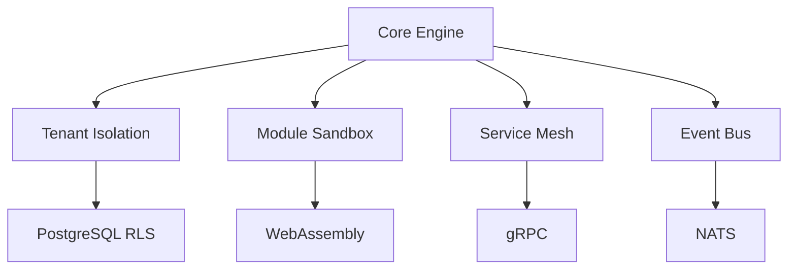
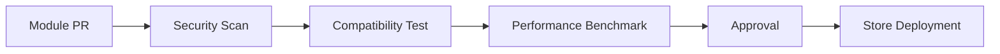

# AIBOS Engine - SaaS Operating System

AIBOS Engine is a true SaaS operating system that provides a modular, plug-and-play platform for business applications. Think of it as "Windows for SaaS" - a central operating system that manages resources, permissions, and communication while allowing developers to create and deploy modules that seamlessly integrate into the ecosystem.

## 🏗️ Architecture Overview

### Core Components

1. **Core Engine** (`apps/core-engine/`) - The "kernel" managing:
   - Tenant lifecycle
   - Module orchestration
   - System event bus
   - Resource allocation
2. **Module Store** (`apps/module-store/`) - Marketplace with:
   - Module discovery
   - Version management
   - Dependency resolution
3. **Admin Console** (`apps/admin-console/`) - Management interface for:
   - Tenant provisioning
   - Module deployment
   - System monitoring
4. **Tenant Portal** (`apps/tenant-portal/`) - Customizable interface per tenant

### Shared Packages

| Package | Responsibility | Key Technologies |
|---------|---------------|------------------|
| `core-sdk` | Module development toolkit | TypeScript, GraphQL |
| `database` | Core schema + migrations | PostgreSQL, TypeORM |
| `auth` | Multi-tenant auth | OAuth2, JWT, RBAC |
| `billing` | Subscription engine | Stripe integration |
| `module-validator` | Security/compliance checks | OPA, SAST tools |
| `module-deployer` | Zero-downtime deployments | Kubernetes, Docker |

## 🚀 Key Features

### Operating System Capabilities


### Module System Specifications
- **Manifest Requirements**:
  ```yaml
  # Required Fields
  id: unique-module-id
  version: semver
  apiVersion: engine-compatibility-version
  dependencies: 
    - core-sdk@^2.3.0
    - auth@^1.5.0
  
  # Security
  permissions:
    - data:read
    - data:write:limited
  
  # Resources
  resourceLimits:
    cpu: 0.5
    memory: 512Mi
  ```

## 🚀 Quick Start

```bash
# Install dependencies
pnpm install

# Develop (all packages)
pnpm run dev

# Build
pnpm run build

# Type check
pnpm run type-check

# Test
pnpm run test
```

## 🛠️ Development Setup

### Enhanced Local Development
```bash
# Start with Docker Compose
docker-compose -f docker-compose.dev.yml up

# Module Development Hot-Reload
MODULE_PATH=./modules/my-module npm run dev:module

# Debugging Tools
npm run debug:core # Starts core with inspector
```

### CI/CD Pipeline


## 🔧 Module Development

### Advanced Module Template
```typescript
// modules/my-module/src/index.ts
import { ModuleBase } from '@aibos/core-sdk';

export default class MyModule extends ModuleBase {
  static metadata = {
    // Type-safe manifest
  };

  async onActivate(tenantId: string) {
    // Tenant-specific initialization
  }

  apiRoutes = [
    {
      path: '/data',
      handler: this.getData,
      middleware: [this.authMiddleware]
    }
  ];
}
```

## 🔒 Security & Governance

### Data Access Control Matrix
| Level | Technology | Enforcement Point |
|-------|------------|-------------------|
| Column | PostgreSQL Encryption | DB Driver |
| Row | RLS Policies | Query Rewriter |
| Field | GraphQL Masking | API Gateway |
| Operation | OPA Policies | Auth Middleware |

## 📊 Observability Stack
- **Metrics**: Prometheus + Grafana
- **Logs**: Loki + Tempo
- **Traces**: OpenTelemetry
- **Audit**: Immutable DB ledger

## ➕ Recommended Additions

1. **Module Versioning Strategy**:
   - Semantic versioning enforcement
   - Automatic rollback on failure
   - Canary deployments

2. **Performance Isolation**:
   ```yaml
   # module-resources.yaml
   quotas:
     default:
       cpu: 1.0
       memory: 1Gi
     premium:
       cpu: 2.0
       memory: 2Gi
   ```

3. **Developer Tools**:
   - `aibos-cli` for module management
   - VSCode extension for manifest validation
   - Local testing sandbox

## 🚀 Next Steps Implementation Guide

1. **Phase 1 - Core Foundation**:
   - Implement tenant isolation
   - Build module loader
   - Create basic SDK

2. **Phase 2 - Ecosystem**:
   - Develop validation pipeline
   - Launch module store
   - Create reference modules

3. **Phase 3 - Scale**:
   - Performance optimization
   - Developer portal
   - Marketplace monetization

## 📁 Project Structure

```
aibos-engine/
├── apps/                    # Applications
│   ├── core-engine/         # Central OS kernel
│   ├── module-store/        # Marketplace frontend
│   ├── admin-console/       # Management interface
│   └── tenant-portal/       # Tenant-facing interface
├── packages/                # Shared packages
│   ├── core-sdk/           # SDK for module development
│   ├── database/           # Core schema and migrations
│   ├── auth/               # Authentication services
│   ├── billing/            # Subscription management
│   ├── module-validator/   # Module validation system
│   ├── module-deployer/    # Module deployment system
│   └── types/              # Shared TypeScript types
├── modules/                # Approved plug-and-play modules
│   ├── crm/               # CRM module example
│   ├── erp/               # ERP module example
│   └── ...                # More modules
├── tools/                  # Development tools and scripts
│   ├── aibos-cli/         # CLI for module management
│   └── vscode-extension/  # VSCode extension
├── docker-compose.dev.yml  # Local development environment
├── .github/               # CI/CD workflows
└── docs/                  # Documentation
```

## 🛠️ Development Setup

### Prerequisites
- Node.js >= 18.0.0
- npm >= 9.0.0
- Docker >= 20.10
- Docker Compose >= 2.0
- PostgreSQL >= 14.0
- Redis >= 6.0

### Installation

```bash
# Clone the repository
git clone <repository-url>
cd aibos-engine

# Install dependencies
npm install

# Set up environment variables
cp .env.example .env.local
# Edit .env.local with your configuration

# Start development environment
docker-compose -f docker-compose.dev.yml up -d

# Run database migrations
npm run db:migrate

# Start development servers
npm run dev
```

### Available Scripts

- `npm run dev` - Start all development servers
- `npm run dev:module` - Start module development with hot-reload
- `npm run debug:core` - Start core engine with inspector
- `npm run build` - Build all packages and apps
- `npm run test` - Run tests across all packages
- `npm run lint` - Lint all code
- `npm run type-check` - Type check all TypeScript code
- `npm run db:migrate` - Run database migrations
- `npm run db:seed` - Seed database with initial data
- `npm run module:validate` - Validate a module
- `npm run module:deploy` - Deploy a module

## 🔧 Module Development

### Creating a New Module

1. **Generate Module Template**:
   ```bash
   npx @aibos/cli module create my-module
   ```

2. **Define Module Metadata**:
   ```yaml
   # modules/my-module/manifest.yaml
   id: my-module
   version: 1.0.0
   apiVersion: v1
   name: My Module
   description: A sample module for AIBOS Engine
   author:
     name: Developer Name
     email: developer@example.com
   dependencies:
     - core-sdk@^2.3.0
     - auth@^1.5.0
   permissions:
     - data:read
     - data:write:limited
   resourceLimits:
     cpu: 0.5
     memory: 512Mi
   ```

3. **Implement Module Interface**:
   ```typescript
   // modules/my-module/src/index.ts
   import { ModuleBase, ModuleMetadata } from '@aibos/core-sdk';

   export default class MyModule extends ModuleBase {
     static metadata: ModuleMetadata = {
       id: 'my-module',
       version: '1.0.0',
       name: 'My Module',
       description: 'A sample module for AIBOS Engine'
     };

     async onActivate(tenantId: string) {
       // Tenant-specific initialization
       console.log(`Module activated for tenant: ${tenantId}`);
     }

     async onDeactivate(tenantId: string) {
       // Cleanup when module is deactivated
       console.log(`Module deactivated for tenant: ${tenantId}`);
     }

     apiRoutes = [
       {
         path: '/data',
         method: 'GET',
         handler: this.getData,
         middleware: [this.authMiddleware]
       }
     ];

     private async getData(req: any, res: any) {
       // Module API implementation
       res.json({ data: 'Hello from MyModule!' });
     }
   }
   ```

4. **Validate and Deploy**:
   ```bash
   # Validate module
   npx @aibos/cli module validate ./modules/my-module

   # Deploy module
   npx @aibos/cli module deploy ./modules/my-module
   ```

## 🔒 Security & Governance

### Data Governance
- **Column-level encryption** for sensitive data
- **Row-level security** (RLS) for tenant isolation
- **Strict access controls** with role-based permissions
- **Audit logging** for all data access and modifications

### Module Security
- **Sandboxed execution** environment using WebAssembly
- **Permission-based access** to system resources
- **Security scanning** during module validation
- **Regular security audits** for all modules

### Performance Isolation
- **Resource quotas** per tenant and module
- **Performance monitoring** and alerting
- **Circuit breakers** for misbehaving modules
- **Rate limiting** to prevent abuse

## 📊 Monitoring & Observability

- **Centralized logging** across all modules
- **Performance metrics** collection
- **Error tracking** and alerting
- **Usage analytics** for modules
- **Health checks** for all services

## 🤝 Contributing

1. Fork the repository
2. Create a feature branch
3. Make your changes
4. Add tests for new functionality
5. Ensure all tests pass
6. Submit a pull request

## 📄 License

This project is licensed under the MIT License - see the [LICENSE](LICENSE) file for details.

## 🆘 Support

- **Documentation**: [docs.aibos-engine.com](https://docs.aibos-engine.com)
- **Community**: [community.aibos-engine.com](https://community.aibos-engine.com)
- **Issues**: [GitHub Issues](https://github.com/aibos-engine/issues) 