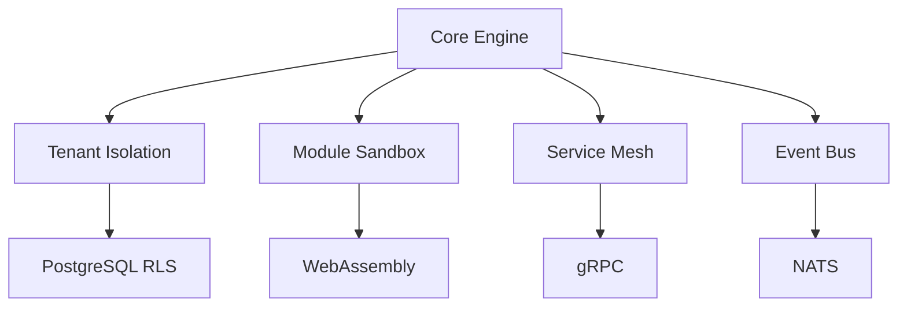
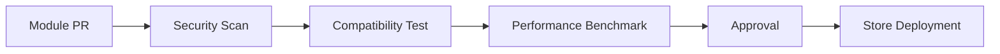

# AIBOS Engine - SaaS Operating System

AIBOS Engine is a true SaaS operating system that provides a modular, plug-and-play platform for business applications. Think of it as "Windows for SaaS" - a central operating system that manages resources, permissions, and communication while allowing developers to create and deploy modules that seamlessly integrate into the ecosystem.

## 🚀 Quick Start

```bash
# Install dependencies
pnpm install

# Develop (all packages)
pnpm run dev

# Build
pnpm run build

# Type check
pnpm run type-check

# Test
pnpm run test
```

## 🏗️ Architecture Overview

### Core Components

1. **Core Engine** (`apps/core-engine/`) - The "kernel" managing:
   - Tenant lifecycle
   - Module orchestration
   - System event bus
   - Resource allocation
2. **Module Store** (`apps/module-store/`) - Marketplace with:
   - Module discovery
   - Version management
   - Dependency resolution
3. **Admin Console** (`apps/admin-console/`) - Management interface for:
   - Tenant provisioning
   - Module deployment
   - System monitoring
4. **Tenant Portal** (`apps/tenant-portal/`) - Customizable interface per tenant

### Shared Packages

| Package | Responsibility | Key Technologies |
|---------|---------------|------------------|
| `@aibos/core` | Core engine implementation | TypeScript, Node.js |
| `@aibos/core-sdk` | Module development toolkit | TypeScript, GraphQL |
| `@aibos/database` | Core schema + migrations | PostgreSQL, TypeORM |
| `@aibos/auth` | Multi-tenant auth | OAuth2, JWT, RBAC |
| `@aibos/billing` | Subscription engine | Stripe integration |
| `@aibos/observability` | Monitoring & metrics | Prometheus, Winston |
| `@aibos/module-validator` | Security/compliance checks | OPA, SAST tools |
| `@aibos/module-deployer` | Zero-downtime deployments | Kubernetes, Docker |
| `@aibos/types` | Shared TypeScript types | TypeScript |

## 🚀 Key Features

### Operating System Capabilities


### Module System Specifications
- **Manifest Requirements**:
  ```yaml
  # Required Fields
  id: unique-module-id
  version: semver
  apiVersion: engine-compatibility-version
  dependencies: 
    - core-sdk@^2.3.0
    - auth@^1.5.0
  
  # Security
  permissions:
    - data:read
    - data:write:limited
  
  # Resources
  resourceLimits:
    cpu: 0.5
    memory: 512Mi
  ```

## 🛠️ Development Setup

### Modern Monorepo Stack
- **Package Manager**: pnpm (3x faster installs, strict dependency isolation)
- **Build System**: Turbo (smart caching, parallel builds)
- **TypeScript**: Strict mode across all packages
- **CI/CD**: GitHub Actions with pnpm

### Enhanced Local Development
```bash
# Start with Docker Compose
docker-compose -f docker-compose.db.yml up

# Module Development Hot-Reload
pnpm --filter @aibos/core run dev

# Debugging Tools
pnpm run debug:core # Starts core with inspector
```

### Workspace Commands
```bash
# Add dependency to specific package
pnpm add --filter @aibos/core lodash

# Run script in specific package
pnpm --filter @aibos/auth run test

# Build all packages
pnpm run build

# Type check all packages
pnpm run type-check
```

### CI/CD Pipeline


## 🔧 Module Development

### Advanced Module Template
```typescript
// modules/my-module/src/index.ts
import { ModuleBase } from '@aibos/types';

export default class MyModule extends ModuleBase {
  static metadata = {
    // Type-safe manifest
  };

  async onActivate(tenantId: string) {
    // Tenant-specific initialization
  }

  apiRoutes = [
    {
      path: '/data',
      handler: this.getData,
      middleware: [this.authMiddleware]
    }
  ];
}
```

## 🔒 Security & Governance

### Data Access Control Matrix
| Level | Technology | Enforcement Point |
|-------|------------|-------------------|
| Column | PostgreSQL Encryption | DB Driver |
| Row | RLS Policies | Query Rewriter |
| Field | GraphQL Masking | API Gateway |
| Operation | OPA Policies | Auth Middleware |

## 📊 Observability Stack
- **Metrics**: Prometheus + Grafana
- **Logs**: Loki + Tempo
- **Traces**: OpenTelemetry
- **Audit**: Immutable DB ledger

## ➕ Recommended Additions

1. **Module Versioning Strategy**:
   - Semantic versioning enforcement
   - Automatic rollback on failure
   - Canary deployments

2. **Performance Isolation**:
   ```yaml
   # module-resources.yaml
   quotas:
     default:
       cpu: 1.0
       memory: 1Gi
     premium:
       cpu: 2.0
       memory: 2Gi
   ```

3. **Developer Tools**:
   - `aibos-cli` for module management
   - VSCode extension for manifest validation
   - Local testing sandbox

## 🚀 Next Steps Implementation Guide

1. **Phase 1 - Core Foundation**:
   - Implement tenant isolation
   - Build module loader
   - Create basic SDK

2. **Phase 2 - Ecosystem**:
   - Develop validation pipeline
   - Launch module store
   - Create reference modules

3. **Phase 3 - Scale**:
   - Performance optimization
   - Developer portal
   - Marketplace monetization

## 📁 Project Structure

```
aibos-engine/
├── apps/                    # Applications
│   ├── core-engine/         # Central OS kernel
│   ├── module-store/        # Marketplace frontend
│   ├── admin-console/       # Management interface
│   └── tenant-portal/       # Tenant-facing interface
├── packages/                # Shared packages
│   ├── core/               # Core engine implementation
│   ├── core-sdk/           # SDK for module development
│   ├── database/           # Core schema and migrations
│   ├── auth/               # Authentication services
│   ├── billing/            # Subscription management
│   ├── observability/      # Monitoring and metrics
│   ├── module-validator/   # Module validation system
│   ├── module-deployer/    # Module deployment system
│   └── types/              # Shared TypeScript types
├── modules/                # Approved plug-and-play modules
│   ├── crm/               # CRM module example
│   ├── erp/               # ERP module example
│   └── ...                # More modules
├── tools/                  # Development tools and scripts
├── scripts/                # Build and deployment scripts
├── .github/                # CI/CD workflows
├── pnpm-workspace.yaml     # pnpm workspace configuration
├── turbo.json             # Turbo build configuration
└── package.json           # Root package configuration
```

## 🛠️ Technology Stack

### Core Technologies
- **Runtime**: Node.js 18+
- **Language**: TypeScript 5.0+
- **Package Manager**: pnpm 8.0+
- **Build Tool**: Turbo 2.5+
- **Database**: PostgreSQL with TypeORM
- **Authentication**: JWT, OAuth2, RBAC
- **API**: GraphQL, REST
- **Containerization**: Docker, Kubernetes

### Development Tools
- **Linting**: ESLint with TypeScript rules
- **Formatting**: Prettier
- **Testing**: Jest
- **CI/CD**: GitHub Actions
- **Monitoring**: Prometheus, Grafana
- **Logging**: Winston

## 🤝 Contributing

1. Fork the repository
2. Create a feature branch
3. Make your changes
4. Run tests: `pnpm run test`
5. Run type check: `pnpm run type-check`
6. Submit a pull request

## 📄 License

This project is licensed under the MIT License - see the LICENSE file for details. 